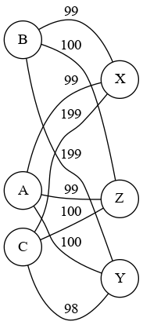

SAE S2.02 -- Rapport pour la ressource Graphes
===

*Noms des auteurs, groupe*

Version 1
---

Sera évaluée à partir du tag git `Graphes-v1`

### Étude d'un premier exemple

*Énumérer tous les appariements acceptables (c'est à dire qui asocient des adolescents compatibles) pour les données de l'Exemple 1, en supposant que les français rendent visite aux italiens.*

-   D’après l’exemple 1, tous les appariement acceptable sont :
    *   Adonia , A — Xolag, X
    *   Adonia , A — Zander, Z
    *   Bellatrix, B — Xolag, X
    *   Callista,C —-Yak, Y

Ces appariement sont possible car comparé au autre il ont des loisirs en commun et il ne faut aussi pas oublier que comme dit dans l'énoncé que les ado francais ne peuvent aller chez un hôte que si il ont un loisir en commun.

Et aussi les autres appariement ne sont pas possible a cause de l’allergie au animaux en effet Bellatrix possède une allergie à l'animal de l'hôte Y.

*Justifier pourquoi l'appariement optimal est Bellatrix--Xolag, Adonia--Zander, et Callista--Yak; cette explication ne doit pas parler de graphes, mais se baser uniquement sur les données du problème.*

L'appariement optimal est Bellatrix--Xolag, Adonia--Zander, et Callista--Yak car comme on a instauré la règle de s’occuper en priorité des adolescent avec le moins de possibilité Bellatrix n’a le choix que d' aller avec Xolag et Callista avec Yak ce qui fait qu’il va nous rester Zander et Adonia qui iront ensemble.

### Modélisation de l'exemple

*Donner un graphe qui modélise l'Exemple 1, plus précisément, la matrice d'adjacence de ce graphe. Expliquez comment vous avez choisi le poids pour chacune des arêtes.*

Pour le choix du poids des arêtes, on les fait tous démarrer à 100. Nous avons fait plus de 100 lorsque les 2 étudiants sont incompatibles et -1 par hobbies communs.

### Modélisation pour la Version 1

*Décrire une modélisation générale pour la Version 1. C'est à dire, donner une formule ou une description précise qui décrit comment, étant donné un adolescent hôte et un adolescent visiteur, on détermine le poids de l'arête entre ces deux adolescents en fonction des critères considérés dans la Version 1.*

Nous enlevons pour un appariement 1 point par hobbie commun, puis nous ajoutons 100 points par contrainte de comptabilité, donc à cause des allergies et autres et donc ici pour l'arrete est lourde moins ils sont compatible.

### Implémentation de la Version 1

*Cette partie du travail sera évaluée à partir du code. Implémenter la fonction weight de la classe AffectationUtil en suivant la modélisation proposée. Puis, implémenter une classe TestAffectationVersion1 qui montre que votre implémentation est correcte. La classe de test doit contenir au moins une méthode de test comme ceci:*
- *créer les adolescents de l'Exemple 1*
- *construire le graphe modèle pour ces adolescents; le graphe sera de type fr.ulille.but.GrahpeNonOrienteValue*
- *calculer l'affectation optimale en utilisant la classe fr.ulille.but.CalculAffectation*
- *écrire des assertions (assertEquals ...) qui vérifient que le résultat de l'affectation calculé à l'étape précédente est bien celui attendu*

*Si vous n'êtes pas à l'aise avec les tests unitaires, votre classe TestAffectationVersion1 peut contenir une méthode main à la palce de la méthode de test, dans ce cas vous afficherez dans le terminal l'appariement résultat.*

Pour l'implémentation nous l'avons dans le fichier [AffectationUtil.java](../src/AffectationUtil.java)

Pour le test il se trouve dans le fichier [AffectationVersion1Test.java](../test/AffectationVersion1Test.java)

### Exemple de vérification de l'incompatibilité 

*Cet exemple va mettre au défi votre modèle vis à vis de la prise en compte de l'incompatibilité entre adolescents*

*Récupérez sur Moodle le fichier de données `compatibilityVsHobbies.csv`. Expliquez quelle est sa particularité de cet exemple. Écrire la méthode de test qui test qui change cet exemple, construit le graphe modèle, calcule l'affectation, et finalement vérifie qu'aucune paire d'adolescents non compatibles n'a été construite par l'algorithme.*

    -   2 chose sont remarquable dans ce fichier : 

        *   On peut voir dans ce fichier que certains adolescents n'ont aucun loisir alors que contrairement à d'autres adolescents qui eux ont beaucoup de loisirs.
        *   Une incohérence est aussi présente dans ce fichier en effet on peut retrouver l’adolescent A A qui est allergique au animaux alors qu’il en possède un.

En implémentant l'exemple donner pour compatibilityVsHobbies nous avons générer 2 graphe different grace a la regle de calcule de poinds mise en place un peu plus haut.

Nous obtenons ce graphe lorsque se sont les Italiens qui se rendent chez les Allemands : 

Nous obtenons ce graphe lorsque se sont les Allemands qui se rendent chez les Italiens : 

Les tests fait pour obtenir ces graphe se trouve dans [AffectationVersion1Test.java](../test/AffectationVersion1Test.java) 
Dans la partie : "Exemple 2 du sujet qui implemente IncompatibilityVsHobbies"

Version 2
---

Sera évaluée à partir du tag git `Graphes-v2`

### Exemple minimal pour la gestion de l'historique

*Présenter un exemple minimal qui est pertinent pour tester l'historique. L'exemple contiendra:*
- *huit adolescents de deux pays différents tels que* 
  - *certains des adolescents expriment des préférences d'historique (critère HISTORY). Toutes les valeurs possibles pour ce critère doivent être présentes* 
  - *aucun des adolescents n'est allergique aux animaux en aucun n'a exprimé de passe-temps, ainsi pour l'instant on peut se concentrer uniquement sur la gestion de l'historique*
- *un historique, c'est à dire une collection de paires d'adolescents qui étaient correspondants l'année passée. Ces paires doivent permettre d'illustrer les différents cas de figure qui peuvent se présenter par rapport aux contraintes d'historique et les huit adolescents*

*Puis, donner un appariement optimal qui tient compte des données d'historique, et expliquer pourquoi il est optimal. L'explication ne doit pas parler des graphes, mais uniquement des adolescents et les critères exprimés.*

Voici un petit exemple que l'on va utiliser pour tester l'historique : 

Voici donc le graphe obtenu avec cette exemple : 

### Deuxième exemple pour la gestion d'historique

*Modifiez l'exemple précédent en ajoutant des préférences liées aux passe-temps. Donnez l'appariement que vous considérez optimal dans ce cas. En particulier, expliquez comment vous comptez combiner une éventuelle affinité liée à l'historique avec l'affinité liée aux passe-temps. Rappelons que l'historique peut compter comme une contrainte rédhibitoire ou comme une préférence, voir le sujet pour plus de précisions.*

*Donner l'appariement que vous considérez optimal dans ce deuxième exemple, toujours sans parler de graphes.*

### Modélisation pour les exemples

*Pour chacun des deux exemples précédents, donnez un graphe (donné par sa matrice d'adjacence) tel que l'affectation minimale dans ce graphe correspond à l'appariement optimal identifié plus haut. Expliquez comment vous avez choisi le poids pour chacune des arêtes.*

### Modélisation pour l'historique de la Version 2

*Décrire une modélisation générale pour la Version 1. C'est à dire, donner une formule ou une description précise qui décrit comment, étant donné un adolescent hôte et un adolescent visiteur, on détermine le poids de l'arête entre ces deux adolescents en fonction des critères considérés dans la Version 1. Décrire également comment vous construisez le graphe modèle à partir des données en entrée.*

Pour modéliser l’historique :
    * Afin de modéliser l’historique nous avons décidé que chaque binôme de Teenager aller être répertoriés dans une Hashmap.
    * Nous avons implémenté des méthodes afin de garder une trace dans un fichier texte des historiques.

### Implémentation de l'historique de la Version 2

*Quelles fonctions de votre code avez-vous modifié pour prendre en compte le critère historique ? Donnez ici les noms des méthodes (et leur classe), à quoi elles servent, et quelles modifications vous avez apportées. Essayez d'être synthétique.*

Pour implémenter cela nous avons créé une nouvelle class History celle-ci a pour but la création d’une HashMap qui ici nous est indispensable pour l’appariement des Teenager. Cette classe dispose de plusieurs méthodes afin d’ajouter des Teenager dans la HashMap. Celle- ci va donc s’occuper de l’historique mais pas que. En effet dans cette classe nous disposons d’une méthode qui par rapport à l'historique va nous renvoyer une valeur. Ici dans cette méthode si 2 Teenager on déjà été ensemble auparavant la méthode renverra -100 et si 2 Teenager n’ont jamais été ensemble la méthode renverra 100.

Comme vous le voyez cette méthode est très pratique est ici va nous servir à évaluer le poids d’une arête en fonction de l’historique des Teenagers.
C’est pour cela que dans notre classe affectation pour la méthode weight nous avons ajouté la nouvelle classe History qui va permettre de a la fin de réévaluer le poids de l'arête.

### Test pour l'historique de la Version 2

*Créer la classe de TestAffectationVersion2 qui contiendra deux méthodes de test, une pour chacun des exemples. Chacune de ces méthodes doit avoir la même structure que pour TestAffectationVersion1, c'est à dire créer les données d'entrée (adolescents, historique), créer le graphe, calculer l'affectation, et tester que le résultat est comme attendu.*

### Prendre en compte les autres préférences

*Pour chacun des autres critères d'affinité que vous décidez de prendre en compte, décrire comment vous changez la fonction weight de la classe AffectationUtil.*

### L'incompatibilité en tant que malus

*Proposer une formule ou une description précise qui explique comment calculer le poids d'une arête en considérant les incompatibilités comme des malus et les critères satisfaits comme des bonus. Implémenter cette formule dans une seconde méthode appelée `weightAdvanced`, ceci pour éviter de casser votre code. Puis, écrire une méthode de test qui permet d'illustrer le calcul d'affectation basé sur `weightAdvanced`. Vous pouvez égalmente tester l'affectation en utilisant le fichier de données `incompatibilityVsBonus.csv`.*

